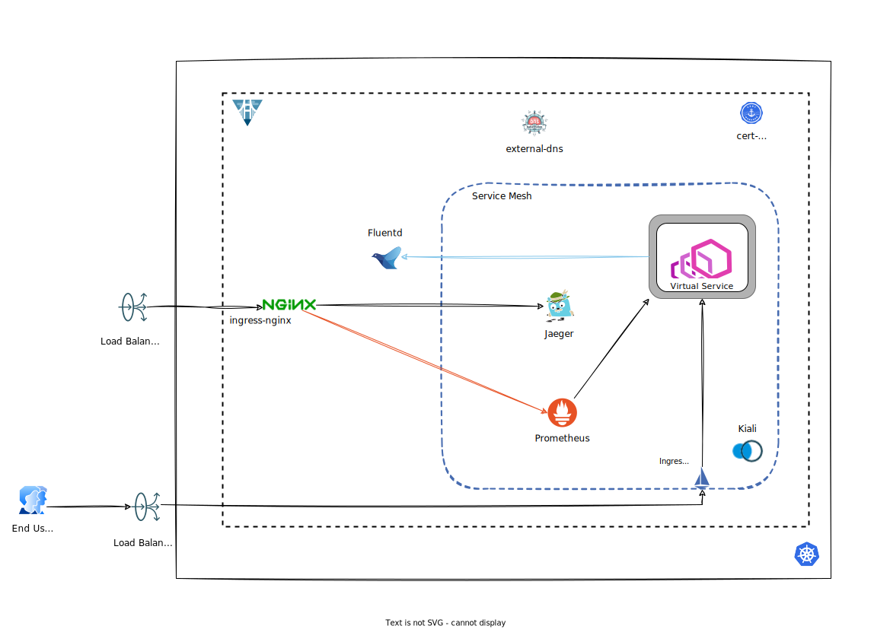

# Multi Cluster

A multi-cluster deployment in Verrazzano consists of an Admin cluster and at least 1 managed cluster. An Admin cluster contains all the same system components as in the single cluster:

whereas a managed cluster typically consists only of the application workload, the service mesh and the observability components:

  - [With Public Endpoints](./pub-ep.md)
  - [With Private Endpoints](./pri-ep.md)
  - [With Public Load Balancers](./pub-lb.md)
  - [With Private Load Balancers](./pri-lb.md)