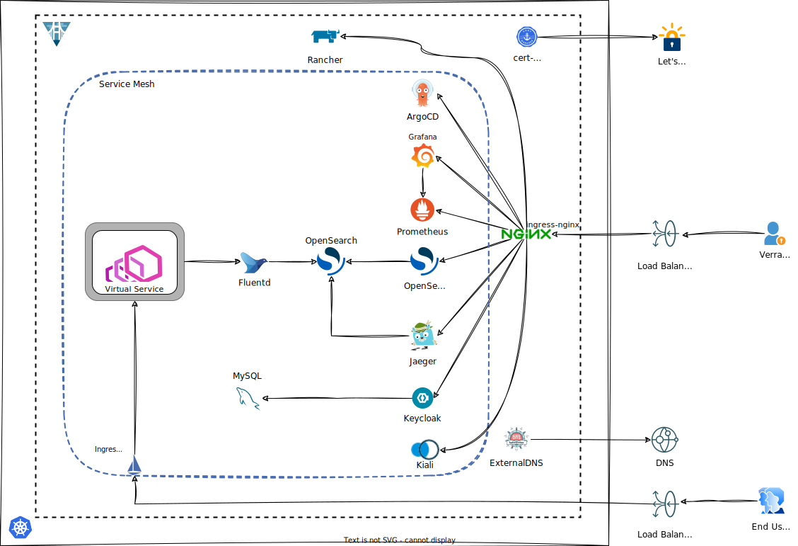

# Single Development Cluster



### Create the OKE cluster

1. Copy terraform.tfvars.example to terraform.tfvars

```bash, editable
cp terraform.tfvars.example terraform.tfvars
```
2. Provide values for the following input variables: 
   - `api_fingerprint`
   - `api_private_key_path`
   - `tenancy_id`
   - `user_id`
   - `compartment_id`
   - `ssh_public_key_path`
   - `ssh_private_key_path`
3. Set your tenancy's home region using `home_region` e.g.

```terraform, editable
home_region = "us-ashburn-1"
```

4. Configure the cluster's provider in admin.tf:

```terraform, editable
  providers = {
    oci      = oci.sydney # replace with the desired region's name
    oci.home = oci.home
  }
```

5. Configure the cluster's parameters:

```terraform,editable
admin_region = {
  admin_name = "admin"
  region     = "Sydney" # must match the provider's region in step 4
  vcn_cidr   = "10.0.0.0/16"
  pods       = "10.200.0.0/16"
  services   = "10.100.0.0/16"
}
```
6. Configure the following input variables:

```
get_kubeconfigs = false
install_verrazzano = false
```
```admonish important
When provisioning the cluster, the above 2 variables must set to `false`.
```

7. Create the cluster by running Terraform:

```bash
terraform init
terraform plan
terraform apply
```

8. After Terraform has finished the apply operation, it will output a convenient SSH command you can copy. This command will allow you to ssh to the operator host.

### Generate Verrazzano Installation scripts

You will now generate the installation script.

1. Configure the following input variables:

```
get_kubeconfigs = true
install_verrazzano = true
```

2. If you want to configure additional Verrazzano components, you can still do so now.

3. Configure the Verrazzano profile:

```
verrazzano_profile = "dev"
```

4. If you need to use your own DNS, you need to configure DNS before you run Terraform and the installation scripts. Else, the installation scripts will use nip.io.

5. Run Terraform again:
```
terraform init
terraform plan
terraform apply
```

```admonish tip
Running `terraform apply` again will configure access to the cluster, give it a friendly name and upload the installation script to the operator host.
```

### Run Verrazzano Installation scripts

You will now install Verrazzano in your cluster.

```admonish tip
1. These steps are to be run manually today. We will automate them in the future.
2. The scripts are to be run from the operator host. 
```

1. ssh to the operator host by copying the convenient SSH command.

2. Install the Verrazzano Platform Operator

```
cd /home/opc/vz/operator
bash install_vz_operator_admin.sh
```

3. Check if the operator has installed sucessfully:

```
bash check_vz_operator_admin.sh
```

4. If you are using your own DNS domain, obtain the yaml for DNS and create a secret:

```
cd /home/opc/vz/oci
bash  get_oci_secret.sh
echo >> oci.yaml

bash create_oci_secret_admin.sh
```

5. If you are using Thanos, configure your secret for OCI Object Storage now.

```
cd /home/opc/vz/clusters
```

6. Edit `thanos_admin_storage.yaml` file and enter the following parameters:

  - compartment_ocid
  - region
  - tenancy_ocid
  - user_ocid
  - fingerprint
  - and the private key

7. Create the secret:

```

kubectl create namespace verrazzano-monitoring
kubectl create secret generic objstore-config -n verrazzano-monitoring --from-file=objstore.yml=thanos_admin_storage.yaml
```

8. Install Verrazzano:

```
cd /home/opc/vz/clusters
bash install_vz_cluster_admin.sh
```

9. Wait for Verrazzano to be installed:

```
bash vz_status.sh
```